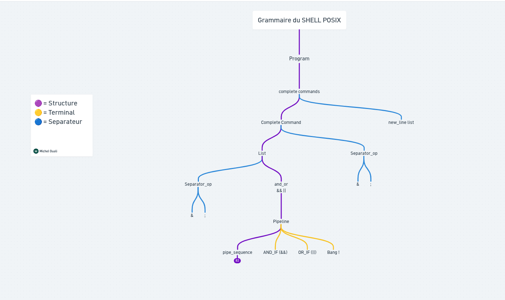
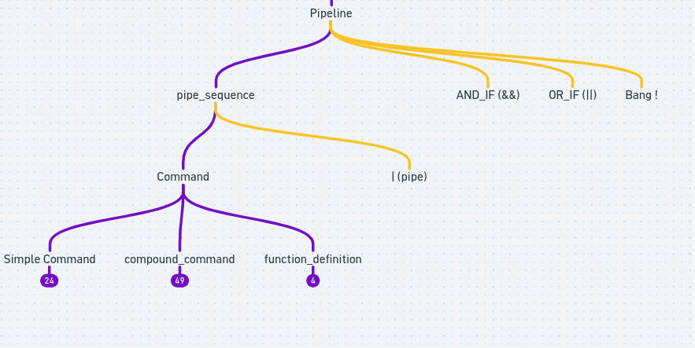
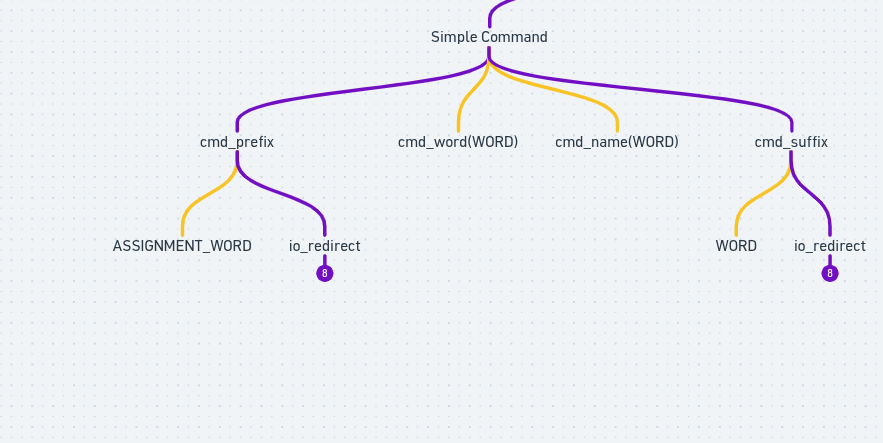
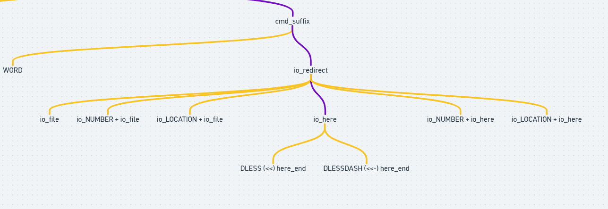

*This project has been created as part of the 42 curriculum by gd-hallu and miouali.*

# Minishell

---

## Tables des matières

1. [Architecture Globale de Minishell](#1-architecture-globale-minishell)
2. [REPL](#2-repl-interface-utilisateur)
3. [Lexer](#3-lexer)
4. [Parser](#4-parser)
5. [Expender](#5-expender)
6. [Executor](#6-executor)
7. [Ressources](#7-ressources)

---

## 1. Architecture globale Minishell

- REPL
- Lexer
- Parser
- Expender
- Exécutor

---

## 2. REPL (interface utilisateur)

### 2.1 Rôle général

Le REPL constitue la boucle principale du shell. Il est responsable de la lecture des commandes utilisateur, de leur transmission au pipeline interne (lexer → parser → executor), puis de l’affichage du résultat.

### 2.2 Lecture des entrées

L’entrée utilisateur est récupérée via `readline`, permettant :
- l’affichage d’un prompt interactif
- la gestion de l’historique des commandes
- une lecture ligne par ligne

### 2.3 Mode interactif

Le REPL fonctionne uniquement en mode interactif (TTY). Dans ce cas, il :
- affiche un prompt dynamique
- reste bloqué en attente d’entrée utilisateur
- réagit aux signaux clavier (Ctrl+C, Ctrl+D)

### 2.4 Gestion mémoire

Une stratégie d’allocation type arena / stack allocator est utilisée afin de :
- limiter les appels à `malloc`/`free`
- réinitialiser rapidement l’état entre deux commandes
- éviter les fuites sur les structures temporaires (tokens, AST)

#### 2.4.1 Principe du stack allocator

Plutôt que d'allouer et de libérer chaque structure individuellement avec `malloc`/`free`, le shell réserve un seul gros bloc mémoire au démarrage (buffer), puis distribue des morceaux de ce bloc au fur et à mesure des besoins, en avançant simplement un pointeur (up). Il n'y a jamais de free individuel : toute la mémoire allouée pendant une commande est libérée d'un coup, en remettant le pointeur au début du buffer.

```c
typedef struct s_header
{
    size_t  size;
    size_t  prev_size;
}   t_header;

typedef struct s_stack_alloc
{
    void    *buffer;
    void    *up;
    void    *curr;
    size_t  capacity;
}   t_stack_alloc;
```
- `buffer` : le bloc mémoire réservé une fois pour toutes (via `init_stack_allocator`).
- `up` : le pointeur "sommet de pile" — l'endroit où la prochaine allocation va s'écrire.
- `curr` : pointeur vers la dernière allocation effectuée.
- `capacity` : la taille totale du buffer.

#### 2.4.2 Allocation

Chaque appel à `stack_alloc(sa, size)` :
- vérifie qu'il reste assez de place dans le buffer,
- écrit un `t_header` juste avant la zone de données allouée. Ce header contient la taille de l'allocation courante (`size`) et la taille de l'allocation précédente (`prev_size`), ce qui permet de « remonter » la chaîne des allocations,
- fait avancer up de `sizeof(t_header) + size`,
- retourne un pointeur vers la zone de données (juste après le header).

Chaque bloc alloué est donc précédé de son header, un peu comme des maillons de chaîne posés côte à côte dans le buffer, ce qui permet ensuite de naviguer d'une allocation à la suivante (voir `next_token` en section 4, qui exploite directement cette disposition mémoire pour parcourir les tokens sans liste chaînée explicite).

#### 2.4.3 Reset

Entre deux commandes, `stack_reset()` ne fait que remettre `up` au début du buffer et `curr` à `NULL` — aucune libération individuelle n'est nécessaire, toute la mémoire de la commande précédente est implicitement réutilisable pour la suivante.

### 2.5 Cycle d’exécution

Chaque itération du REPL suit le pipeline suivant :
```plaintext
readline → lexer → parser → executor → free/reset → next input
			                ↓      ↑
                             expander
```

---

## 3. Lexer

Le lexer transforme une ligne de commande shell en une suite de tokens exploitables par le parser. Chaque token contient un type (t_type_tk), une valeur textuelle, et un ensemble de flags décrivant ses propriétés lexicales (quoted, expansion, tilde, etc.).

Le lexer repose sur un automate à 4 états :

`LX_NORMAL`
`LX_SQUOTE`
`LX_DQUOTE`
`LX_OPERATOR`

Les contextes secondaires (backtick, arithmétique, commentaire, échappement, tilde, expansion) sont portés par les flags du token (`TOKF_SQUOTE`, `TOKF_DQUOTE`, `TOKF_BACK_TICK`, `TOKF_ARITH`, `TOKF_COMMENT`, `TOKF_ESCAPE`, `TOKF_SPEC_PARAM`, `TOKF_EXPANSION`, `TOKF_TILDE`), et non par des états distincts.

Le lexer s'appuie sur un string builder pour construire efficacement les mots shell composés de segments concaténés (texte brut, portions quotées, expansions, etc.).

Les tokens sont stockés dans une liste doublement chaînée, chacun disposant d'un champ dédié pour porter le contenu résolu d'un here-doc.

### 3.1 Tokenisation du Shell

Principe général, le shell lit l’entrée caractère par caractère, et applique la première règle applicable parmi une liste ordonnée. C’est un automate glouton: une fois qu’un token a commencé, on lui ajoute des caractères jusqu’à ce qu’une règle dise STOP.

Attention il y a deux mode distinct:
- tokenisation ordinaire – ce que décrit la section suivante
- Here-doc – mode spéciale déclenché par `<<` ou `<<-`

Voici les 10 règles à suivre dans l’ordre, le premier à qui l’une des règles est applicable, “gagne” :
- Fin d’entrée (EOF) – Le token en cours est délimité. Fin de la tokenisation.
- Continuation d'opérateur – Le caractère précédent était dans un opérateur ET le courant peut l’étendre -> ajouté à l'opérateur. ex `& + & = &&`.
- Fin d’opérateur – Le précédent était un opérateur `&` et le courant ne peut pas l’étendre du coup token émis, puis on recommence.
- Quoting: `\’”$’` – Affecte les caractères suivants jusqu’à la fin du texte quoté. Aucune substitution réelle ne se fait ici: le token contient les caractère bruts, quotes comprises, ne délimite pas le token.
- Expansion: `$` ou  – Lit suffisamment pour trouver la fin de l’expression (récursif). Le résultat brut `($(...)`, `${...}`, `$((...))`, `...` est inclus tel quel dans le token, ne délimite pas le token.
- Début d’opérateur – Caractère non quoté pouvant démarrer un opérateur (`|`, `&`, `;`, `<`, `>`, `(`, `)`), on délimite le token en cours comme opérateur.
- Espace, tab non quoté – Délimite le token en cours. Le blanc est jeté (pas dans le token).
- Continuation de mot – le précédent était un mot -> on ajoute au mot.
- Commentaire `#` Tout jusqu’au `\n` est jeté (sauf le `\n` lui même).
Sinon, création d’un nouveau mot.

### 3.2 Alias

Les alias sont à substituer durant la partie du lexing, si on a alias `ll=ls -la`, quand le shell lit `ll`, il substitue ce token par `ls -la` et reprend la lecture de ce nouveau text. Voici les 5 conditions pour qu’un alias soit substitué.
Le token:
- Ne pas contenir de quotes (`‘`, `“`, `\`) – un token quoté n’est jamais substitué.
- Etre un nom d’alias valide – lettres, chiffres, `_`, `-` et `.` uniquement.
- Correspondre à un alias défini – l'alias doit exister dans la table.
- Ne doit pas résulter de la substitution du même alias – protection anti-boucle infinie.
- Et être en position de commande, Ou suivre un alias qui se termine par un espace.

Si tout est ok, on peut procéder à la substitution.

### 3.3 Structs

```c
*lexer.h*
typedef enum e_type_token {
	TOK_WORD,
    TOK_COMMAND,
    TOK_ASSIGNMENT_WORD,
    TOK_NAME,
    TOK_IO_NUMBER,
    TOK_IO_LOCATION,
    TOK_RESERVED_WORD,
    TOK_PIPE,
    TOK_AND_IF, // &&
    TOK_OR_IF, // ||
    TOK_AMPERSAND, // &
    TOK_SEMI, // ;
    TOK_DSEMI, // ;;
    TOK_SEMI_AND, // ;&
    TOK_LESS, // <
    TOK_GREAT, // >
    TOK_DLESS, // <<
    TOK_DGREAT, // >>
    TOK_LESSAND, // <&
    TOK_GREATAND, // >&
    TOK_LESSGREAT // <>
    TOK_DLESSDASH, // <<-
    TOK_CLOBBER, // >|
    TOK_LPAREN, // (
    TOK_RPAREN, // )
    TOK_NEWLINE,
    TOK_EOF
}	t_type_token;

typedef enum e_flag_token {
    SQUOTED = 1 << 0,
    DQUOTED = 1 << 1,
    BACK_TICK = 1 << 2,
    ARITH = 1 << 3,
    COMMENT = 1 << 4,
    ESCAPED = 1 << 5,
    GLOB = 1 << 6
    TILDE = 1 << 7
}

typedef enum e_state_lexer {
	NORMAL = 1 << 0,
	SQUOTED = 1 << 1,
	DQUOTED = 1 << 2,
	BACK_TICK,
	ARITH,
	COMMENT,
	OPERATOR,
	ESCAPED,
	HERE_DOC,
    EXPENSION,
} t_state_lexer

struct s_token {
	char		*value;
	t_flag_token	flags;
	t_type_token	type_tk;
} t_token

utility.h

typedef struct s_arena_allocator {
	void	*buffer;
	size_t	capacity;
	size_t	offset;
}	t_arena_allocator

typedef struct s_string_builder {
	char	*str;
	size_t	capacity;
	size_t	offset;
} t_string_builder;

typedef enum e_return_value {
	ERROR,
	SUCCESS,
	INSUFICIENT_MEM,
	BAD_ALOCATION,
	OFFSET_ERROR,
} t_return_value;
```

### 3.4 Gestion des erreurs

Le lexer ne gère que très peu d'erreurs syntaxiques intrinsèques, son rôle étant principalement de transformer le flux de caractères en une suite de tokens.

Les erreurs remontées par le lexer concernent essentiellement :
- les échecs d'allocation mémoire
- les erreurs internes liées aux structures dynamiques (stack, string builder, etc.)
- les quotes non fermées (`LX_SQUOTE_NF`, `LX_DQUOTE_NF`)

Le traitement du here-doc (résolution du contenu, gestion des délimiteurs `<<`/`<<-`) est effectué au niveau du parser, une fois les tokens émis par le lexer.
La majorité des erreurs utilisateur (syntaxe invalide, opérateurs mal positionnés, structures grammaticales incorrectes, etc.) sont détectées au niveau du parser, qui possède une vision structurelle complète de la commande.

---

## 4. Parser

### 4.1 Définition

Le parser va recevoir toute la commande qui a été traitée par le lexer. Le lexer a placé des tokens de correspondance dans toute la commande lue par readline. Le parser va quant à lui utiliser ses tokens pour construire l’AST en utilisant des règles bien précises du shell qui seront présentées ci-après.

### 4.2 Syntaxe BNF

La syntaxe BNF (Backus-Naur Form) est la syntaxe sous laquelle sont présentées les règles de grammaire du shell.

Exemple :

```plaintext
rule :	choix1
    	| choix2
     	| choix 3
     ;


:   → "est défini comme"
|   → "ou"
;   → fin de la règle
minuscules   → règle (non-terminal) → doit être développée
MAJUSCULES   → token final (terminal) → vient directement du lexeur
'|'  '<<'    → token littéral entre quotes

%token  AND_IF    OR_IF    DSEMI    SEMI_AND
/*      '&&'      '||'     ';;'     ';&'   */


%token  DLESS  DGREAT  LESSAND  GREATAND  LESSGREAT  DLESSDASH
/*      '<<'   '>>'    '<&'     '>&'      '<>'       '<<-'   */


%token  CLOBBER
/*      '>|'   */
```

Exemple concret :

```plaintext
and_or : pipeline
       | and_or AND_IF linebreak pipeline
       | and_or OR_IF  linebreak pipeline

```

Se lit : “un `and_or` c’est soit un pipeline tout seul, soit un `and_or` suivi de `&&` suivi d’un pipeline ou sinon c’est un and_or suivi de `||` et suivi d’un pipeline.

On va maintenant lister toutes les règles de grammaire du shell et expliquer lesquelles nous allons implémenter dans notre minishell.

### 4.3 Presentation de toutes les règles de grammaire du shell

La grammaire du shell est en elle-même assez complexe, mais nous allons essayer de l'expliquer simplement. Plutôt que de tout présenter en syntaxe BNF, peu visuelle, nous allons nous appuyer sur un diagramme semblable à un arbre généalogique.

#### 4.3.1 Les trois parties de la grammaire

La grammaire du shell se divise en trois catégories distinctes :
- Les structures (ou non-terminaux) sont des éléments décomposables en d'autres symboles. Elles représentent les règles de production de la grammaire et définissent comment les éléments s'assemblent pour former des commandes ou des scripts.
- Les séparateurs sont des symboles dont le rôle est de séparer, organiser ou ponctuer les éléments d'un script. Ils ne sont pas des commandes, mais des outils de contrôle du flux ou de syntaxe.
- Les terminaux sont les éléments de base indécomposables du langage shell — les mots, symboles ou tokens qui apparaissent tels quels dans un script. Ils forment le lexique du shell.

#### 4.3.2 Suivre la grammaire pas à pas

Pour mieux comprendre son fonctionnement, prenons un exemple concret et suivons son chemin dans l'arbre.
```bash
grep "error" file.log > output.txt
```

<p align="center">
    
</p>

C'est une seule commande, ce qui va simplifier les choses. Il n'y a pas de pipe, donc on entre directement dans `command`. On y trouve une commande simple suivie d'une redirection, ce qui nous amène dans `simple_command`.

<p align="center">
    
</p>

On peut maintenant assigner des terminaux à chaque morceau de la commande. `grep` correspond à `cmd_name`, `"error"` à `cmd_word`, et dans `cmd_suffix` on remarque la possibilité d'avoir une redirection — on entre donc dans `io_redirect`.

<p align="center">
    
</p>

On peut commencer à assigner des terminaux à des bouts de commandes ! On peut assigner cmd_name a `grep` et “error” a `cmd_word` et on remarque dans `cmd_suffix` on a la possibilité d’avoir une redirection donc on peut rentrer dans io_redirect.

<p align="center">
    
</p>

On arrive finalement dans `io_file`. La commande est entièrement décomposée selon la grammaire POSIX, en respectant les ordres de priorité.
Suivez ce lien pour retrouver la grammaire complète : [Grammaire Shell POSIX](https://whimsical.com/qg38/grammaire-shell-posix-TdaU8GwvT9Fy5HcZRTHakW)

### 4.4 Règles utilisées dans minishell

Dans minishell, D'après le sujet, on ne doit pas tout implémenter cette grammaire assez complexe, il nous faut juste toucher aux commandes donc toute la partie ou l’on peut trouver les if, while, for etc etc n’est pas à implémenter .Ci après la grammaire finale pour minishell qui représente ce que le sujet demande: [Grammaire pour Minishell](https://whimsical.com/qg38/grammaire-shell-posix-minishell-DDLEcK3FNcjb5MQDs9kKhp).

### 4.5 Utilisation dans le parser

Le parser de ce projet sera un ast binaire, ou on aura préalablement défini les règles de la grammaire SHELL. le parser quand a lui construira un arbre binaire avec juste les chemins de la commande en question.

#### 4.5.1 Ordres de priorités

Le parser doit respecter les priorités naturelles du shell lors de la construction de l’AST. Toutes les commandes ne sont pas au même niveau dans la grammaire.
Par exemple :
```bash
cat file | grep hello > out.txt
```
Le parser doit comprendre que :
`grep hello > out.txt` est une commande avec une redirection.
Le pipe `|` relie deux commandes complètes.
La redirection `>` appartient uniquement à la commande de droite.
L’AST final représentera donc d’abord le pipe comme opérateur principal, avec à gauche `cat file` et à droite `grep hello > out.txt`.
Autre exemple :
```bash
echo test > file1 > file2
```
Les redirections sont analysées de gauche à droite. Le parser ajoute donc chaque redirection à la structure de commande dans l’ordre rencontré.
Le respect des priorités est essentiel car une mauvaise association des opérateurs changerait complètement le comportement de la commande.

### 4.6 AST dans le parser

Une fois les tokens analysés selon les règles de grammaire, le parser construit un AST (Abstract Syntax Tree). Chaque nœud représente soit une commande, soit un opérateur (`|`, `&&`, `||`).

Contrairement à une redirection représentée comme un nœud séparé dans l'arbre, les redirections sont rattachées directement au nœud de commande (`NODE_CMD`) auquel elles s'appliquent, sous forme de liste chaînée. Un nœud de commande porte ainsi :

- une liste chaînée de ses mots/arguments (`tokens`)
- une liste chaînée de ses redirections (`redirect`)
Exemple :
```bash
ls -l | grep minishell > out.txt
```
Peut être représenté sous la forme :
```plaintext
              PIPE
             /    \
      CMD(ls -l)   CMD(grep minishell)
                       redirect: > out.txt
```
Le here-doc (`<<`, `<<-`) est résolu directement au moment du parsing de la redirection : dès qu'un token `<<` est rencontré, son contenu est lu et attaché au token de l'opérateur avant de poursuivre la construction de l'arbre.
```c
typedef enum e_node_type
{
    NODE_CMD,
    NODE_PIPE,
    NODE_AND,
    NODE_OR
}   t_node_type;

typedef struct s_ast
{
    t_node_type     type;
    struct s_ast    *left;
    struct s_ast    *right;
    t_tk            *redirect;
    t_tk            *tokens;
}   t_ast;
```

---

## 5 Expender

### 5.1 Définition

L'expandeur a le rôle au sein de minishell de transformer les noeuds WORD de l’AST en strings finales prêtes à l'exécution, en résolvant dans l'ordre toutes les expansions définies par POSIX.

### 5.2 Word expansions

Il y a plusieurs variantes d’expansions, qui performent sur les tokens que le lexer va créer. Toutes les expansions ne se font pas sur tous les types de mots, Les expansions données pour un mot/token données sont dans l’ordre:
- Tilde expansion
- Parameter Expansion
- Command Substitution
- Arithmetic Expansion
- Field Splitting
- Pathname Expansion
- Quote Removal

Le `$` est utilisé pour introduire les expansions de paramètres, de commandes et d'arithmétique.

Le comportement est le suivant :

- Si `$` est **non quoté** (ni dans `'...'`, ni précédé de `\`) et suivi de l’un des caractères suivants :

  - Un nom de variable valide (lettre ou `_` en premier) → **Parameter Expansion**
  - `{` → **Parameter Expansion** sous forme longue : `${...}`
  - `(` → **Command Substitution** : `$(...)`
  - `((` → **Arithmetic Expansion** : `$((...))`
  - Un paramètre spécial (`@`, `*`, `#`, `?`, `-`, `$`, `!`, `0-9`) → **Parameter Expansion**
  - `'` → **ANSI-C Quoting** : `$'...'` (interprète `\n`, `\t`, etc.)

- Si `$` est suivi d’un espace, d’une tabulation, d’un retour à la ligne, ou se trouve en fin d’entrée → il est traité comme un caractère `$` littéral.

- Si `$` est suivi de n’importe quel autre caractère (par exemple `$,` ou `$.`) → comportement non spécifié par POSIX.

### 5.3 Tilde Expansion

Un préfixe tilde est composé d'un `~` non quoté en début de mot, suivi de tous les caractères jusqu'au premier `/` non quoté, ou jusqu'à la fin du mot si aucun `/` n'est présent.

|Préfixe			|Résultat |
| :---              | :--- |
| ~ seul			| Valeur de $HOME, si HOME non défini -> comportement non spécifié |
| ~login			| Répertoire home de l’utilisateur login via `getpwnam()`. Si introuvable -> pas de substitution, le ~login reste littéral |
| ~+			| Valeur de $PWD |
| ~-			| Valeur de $OLDPWD. Si non défini -> pas de substitution |

Dans les affectations (VAR=valeur), un préfixe tilde peut apparaître:
- Immédiatement après le =
- Immédiatement après chaque : non quoté
```sh
PATH=~/bin:~root/test
#
# préfixe 1 préfixe 2
```
Un préfixe tilde dans une affectation se termine au premier : ou `/` non quoté, ou à la fin du mot.
Important: la tilde expansion ne s’applique pas si le `~` est quoté de quelque façon que ce soit.` ‘ “ \`.

### 5.4 Extension des paramètres

Le format d’Extension des paramètres est le suivant:
`${expression}`,
ou expression se compose de tous les caractères jusqu’à correspondance `}`. N’importe quel `}` échappé, présent dans une chaîne entre guillemet, et des caractères dans les extensions arithmétiques intégrées, les substitutions de commandes et les variables les expansions ne doivent pas être examinées pour déterminer la correspondance. La forme de base est celle ci `${EXPRESSION}` ou `$NOM` ( sans accolades, s'arrête au premier caractère invalide dans le nom)
```sh
# Formes simples
$VAR			# valeur de VAR
${VAR}			# idem, forme explicite
# Valeurs par défaut
${VAR:-mot} 		# si VAR non défini ou vide → expand mot
${VAR-mot} 		# si VAR non défini → expand mot
${VAR:=mot}		# si VAR non défini ou vide → assigne et expand mot
${VAR=mot} 		# si VAR non défini → assigne et expand mot
${VAR:?mot} 		# si VAR non défini ou vide → erreur avec message mot
${VAR?mot} 		# si VAR non défini → erreur avec message mot
${VAR:+mot} 		# si VAR défini et non vide → expand mot (sinon vide)
${VAR+mot} 		# si VAR défini → expand mot (sinon vide)
# Longueur
${#VAR} 		# longueur de la valeur de VAR
# Suppression de sous-chaîne
${VAR#motif} 		# supprime le motif le plus court en début
${VAR##motif}		# supprime le motif le plus long en début
${VAR%motif} 		# supprime le motif le plus court en fin
${VAR%%motif}	# supprime le motif le plus long en fin```
Paramètres spéciaux (Ce sont les variables en lectures seules gérées par le shell)
Paramètre		Signification
$0			Nom du script ou du shell
$1… $9			Arguments positionnels
$@			Tous les arguments, séparés individuellement
$*			Tous les arguments, en un seul mot (séparateur = $IFS)
$?			Code de retour de la dernière commande
$$			PID du shell courant
$!			PID du dernier processus en arrière-plan
$-			Flags du shell courant
```

### 5.5 Command substitution

`$(cmd)` et `cmd`: le shell exécute cmd dans un sous-shell(sub shell), capture sa sortie standard, supprime les newlines finaux, et substitue.

### 5.6 Arithmetic Expansion

`$((expr))`: évalue expr comme une expression entière.

### 5.7 Field splitting

découpe le résultat des expansions sur les caractères de `$IFS` (par défaut espace, tab, newline). Ne s’applique pas aux parties **quotées**

### 5.8 Pathname Expansion (globbing)

Principe
Après le field splitting, chaque mot contenant un caractère spécial non quoté (`*`, `?`, `[`) est traité comme un pattern à matcher contre les entrées du systeme de fichier. Si des correspondances existent, le mot est remplacé par la liste trié des chemins correspondants. Si aucune correspondance n’existe, le mot est laissé tel quel (pas d’erreur). La pathname expansion ne s’applique pas si le pattern ne contient aucun `*` `?` `[` non quoté.
**Les trois caractères spéciaux**
Ces caractères n’ont leur sens spécial que s’ils sont **non quotés, non echappé, et hors bracket expression (sauf si `[` l’introduit**):
`?` — match exactement **un** caractère quelconque.
`*` — match **n’importe quelle chaîne**, y compris la chaîne vide. Matche le plus grand nombre de caractères possible tout en permettant au reste du pattern de matcher.
`[. . .]` — bracket expression: matche **un seul** caractère parmi ceux listés.
`[a,b,c]` -> a, b ou c
`[a-z]`-> plage selon la collation locale
`[!abc]` -> tout sauf a, b, c (le ! remplace le ^ des regex)
Un `[` qui n’introduit pas une bracket expression valide est traité comme un caractère littéral
Un caractère spécial est quoté ou échappé par `\`, il perd son sens spécial et match littéralement. Pour les fichier caché, `*` ne les captes pas
**Règles spécifiques aux chemins**
Le `/` et le `.` initial ont un statut particulier:
**Le slash** / ne peut jamais être matché – il doit être écrit explicitement dans le pattern:
```sh
*.c		# matche foo.c mais pas src/foo.c
src/*.c		# matche src/foo.c
```
Un `/` à l'intérieur d’une bracket d’expression est invalide – le `[` est alors traité comme un caractère littéral
```sh
[a/b]		# ne matche pas a/b – le [ est littéral, le pattern = “[a/b]”
```
**Permissions requises**
Pour un pattern comme `/foo/bar/x*/bam`:
`/` et `foo/`: permission de recherche (x)
`bar/`: permission de recherche et lecture
Chaque répertoire `x*/` trouvé: permission de recherche (x)
Si une permission est refusée ou qu’une lecture de répertoire échoue pour une raison liée au contenue du file system -> pas une erreur, la pathname expansion continue comme si le répertoire était vide.
Tri des résultats
Les correspondances sont retournées **triées selon la collation locale** (LC_COLLATE). Si deux entrées sont équivalent selon cette collation, elles sont départagées **octet par octet** selon la collation POSIX.

### 5.9 Quote Removal

Dernière étape: suppression de tous les `\`, `‘. . .’`, `“. . .”` qui n’ont pas été produits par une expansion. C’est cette étape qui “nettoie” le mot final.

### 5.10 Variables d’environnement

Les variables d’environnement sont un ensemble de paires clé/valeur accessibles par le shell et les processus qu’il lance.
Exemples :
```bash
PATH=/usr/bin:/bin
HOME=/home/user
USER=boss
```
Elles sont utilisées par l’expander pour remplacer les références de type :
```bash
echo $USER
```
par leur valeur associée avant l’exécution de la commande.

#### 5.10.1 Rôle dans le shell

Les variables d’environnement interviennent dans plusieurs étapes :
l’expansion (`$VAR`)
l’exécution des programmes externes (`execve`)
les builtins (`export`, `unset`, `env`)
certaines variables spéciales (`$?`, `$PATH`, etc.)

#### 5.10.2 Structure interne (hash table)

L’environnement est stocké dans une table de hachage permettant un accès rapide aux variables.
Conceptuellement :
```plaintext
key   → hash → bucket → value
```
Exemple :
```plaintext
"PATH" → hash → [ ... ] → "/usr/bin:/bin"
```
Cette structure permet :
accès rapide à une variable (O(1) en moyenne)
insertion efficace (`export`)
suppression (`unset`)
mise à jour de valeur existante

#### 5.10.3 Conversion pour execve

Avant l’exécution d’un programme externe, la table de hachage est convertie en tableau :
```c
envp = [
    "KEY=value",
    "PATH=/bin",
    "USER=boss"
]
```
Ce format est requis par `execve()`.

#### 5.10.4 Variable spéciale

`$?`
contient le code de retour de la dernière commande exécutée et est mis à jour après chaque `waitpid()`.

---

## 6. Executor

### 6.1 Définition
L’executor est la partie du minishell responsable de l’exécution de l’AST généré par le parser.
Contrairement au parser, il ne vérifie plus la syntaxe de la commande. Il considère que l’arbre reçu est déjà validé et applique les règles d’exécution associées à chaque type de nœud.
Le rôle principal de l’executor est donc :
parcourir l’AST,
gérer les processus,
appliquer les redirections,
connecter les pipes,
exécuter les builtins ou les binaires,
récupérer les exit status.

### 6.2 Fonctionnement général

L’executor parcourt l’AST de manière récursive.
Chaque nœud représente une action particulière :
commande simple,
pipe (`|`),
opérateur logique (`&&`, `||`),
redirection.
Selon le type du nœud rencontré, l'exécuteur applique une logique différente.
Exemple :
```bash
ls -l | grep minishell
```
AST simplifié :
```plaintext
       PIPE
       /    \
   ls -l   grep minishell
```
L’executor détecte un nœud `PIPE` et :
- créer un pipe,
- fork les deux branches,
- redirige les file descriptors,
- exécute les deux commandes,
- attend la fin des processus.

### 6.3 Commandes simples

Une commande simple correspond à l’exécution classique d’un programme.
Exemple :
```bash
cat -e file.txt
```
Le lexer transforme la ligne en tokens :
```c
WORD(cat)
WORD(-e)
WORD(file.txt)
```
Puis le parser construit une simple command contenant :
```
cmd  : cat
argv : ["cat", "-e", "file.txt"]
```
L’executor :
- résout le chemin du binaire via le `PATH`,
- construit le tableau `argv`,
- fork un processus enfant,
- Exécute `execve`.

Dans le cas où la commande contient déjà un chemin absolu :
```bash
/bin/cat -e file.txt
```
aucune recherche dans le `PATH` n’est nécessaire.

### 6.4 Builtins

Les builtins sont des commandes implémentées directement dans le shell.
Exemples :
- `cd`
- `echo`
- `pwd`
- `export`
- `unset`
- `env`
- `exit`

Contrairement aux commandes externes, certains builtins doivent être exécutés dans le processus principal du shell afin de modifier son état interne.

Exemple :
```bash
cd /tmp
```
Le changement de répertoire doit affecter le shell courant. Si le builtin était exécuté dans un processus enfant, le parent ne changerait jamais réellement de dossier.

### 6.5 Pipes

Les pipes permettent de connecter la sortie standard d’une commande à l’entrée standard d’une autre.
Exemple :
```bash
cat file.txt | grep hello
```
Le pipe ne transmet pas des fichiers mais un flux de données entre deux processus.
L’executor doit :
- créer un pipe avec `pipe()`,
- fork les deux processus,
connecter :
- stdout de gauche vers le pipe,
- stdin de droite vers le pipe,
- exécuter les deux branches en parallèle,
- fermer les file descriptors inutiles,
- attendre les enfants.

### 6.6 Opérateurs logiques

Les opérateurs `&&` et `||` contrôlent le flux d’exécution selon le statut de retour de la commande précédente.
AND (`&&`)
```bash
make && ./program
```
La commande de droite est exécutée uniquement si la commande de gauche réussit (`exit status == 0`).
OR (`||`)
```bash
make || echo error
```
La commande de droite est exécutée uniquement si la commande de gauche échoue.
L’executor utilise donc le code de retour des processus pour décider du parcours de l’AST.

### 6.7 Redirections

Les redirections modifient les file descriptors avant l’exécution d’une commande.
Types de redirections implémentées :
- `<` : redirection d’entrée.
- `>` : redirection de sortie.
- `>>` : ajout en fin de fichier.
- `<<` : heredoc.

Exemple :
```bash
grep hello < infile > outfile
```
L’executor :
- ouvre les fichiers nécessaires,
- utilise `dup2()` pour remplacer stdin/stdout,
- ferme les anciens file descriptors,
- lance ensuite la commande.
- Les redirections sont appliquées avant `execve`.

### 6.8 Exit Status

Après chaque exécution, le shell récupère le statut de sortie du processus via `waitpid()`.
Ce statut est stocké afin de reproduire le comportement du shell standard avec `$?`.

Exemple :
```bash
ls not_existing_file
echo $?
```
Le shell affichera le code d’erreur retourné par `ls`.

### 6.9 Architecture générale

Le fonctionnement global de l’executor peut être résumé ainsi :
```plaintext
AST
 │
 ▼
Executor(node)
 │
 ├── PIPE      → pipe + fork + dup2
 ├── AND/OR    → logique conditionnelle
 ├── CMD       → builtin ou execve
 └── REDIR     → modification des file descriptors
```

L’executor applique récursivement les règles d’exécution correspondant à chaque type de nœud de l’AST.

### 6.10 Subshells

Un subshell est un environnement d’exécution isolé créé par le shell afin d’exécuter une partie de l’AST dans un processus distinct.

Exemple :
```bash
(cd /tmp && ls)
```

Dans cet exemple, le changement de répertoire n’affecte que le processus du subshell. Une fois celui-ci terminé, le shell principal conserve son répertoire courant.
L’AST peut contenir un nœud SUBSHELL représentant une expression entre parenthèses :
```plaintext
     SUBSHELL
         |
        AND
       /   \
     CMD   CMD
```
Lors de l’exécution :
- l’executor crée un nouveau processus avec fork(),
- le processus enfant exécute récursivement le sous-arbre associé,
- le processus parent attend sa terminaison avec waitpid(),
- Le code de retour du subshell devient le code de retour du nœud.
- Cette approche permet de reproduire le comportement des shells POSIX où les modifications d’environnement réalisées dans un subshell ne sont pas propagées au shell parent.

---

## 7. Ressources

- https://pubs.opengroup.org/onlinepubs/9799919799/utilities/V3_chap02.html
- https://www.gnu.org/software/bash/manual/bash.html
- https://www.sciencedirect.com/science/article/abs/pii/S2590118420300046
- https://arxiv.org/abs/1907.05308
- https://learngitbranching.js.org
- https://docs.google.com/spreadsheets/d/1BPW7k81LJPhGv2fbi35NIIoOC_mGZXQQJDnV0SjulFs/edit?pli=1&gid=0#gid=0
- https://whimsical.com/qg38/grammaire-shell-posix-TdaU8GwvT9Fy5HcZRTHakW
- https://pauillac.inria.fr/~remy/poly/system/camlunix/index.html
